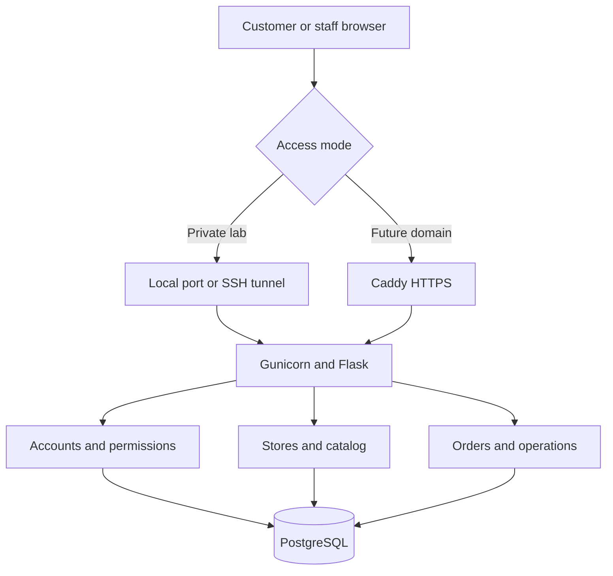

# 7by11.com Marketplace

A runnable multi-store marketplace starter with a responsive storefront and customer, seller, admin, delivery, warehouse, support and finance workspaces. **Payment, refunds and payouts are simulations. Do not collect real payments with this release.**

**New here? Read [START_HERE.md](START_HERE.md) for one-command launch options and all role accounts.**

## Start here

Use Linux, macOS Terminal, or Ubuntu in WSL2 with Docker Desktop integration. Run every command below from the extracted `sevenbyeleven` directory. Do not run the original Northstar Compose file alongside this one on port 3000.

```bash
python3 scripts/init-env.py
docker compose config --quiet
docker compose up --build -d --wait --wait-timeout 180
python3 scripts/smoke.py
```

Open **http://localhost:3000**. Expected: branded catalog and `PASS` from the smoke script. First image download needs internet; slower connections may exceed 180 seconds. Use `docker compose ps` and `docker compose logs --tail=100` before retrying.

Demo accounts: `customer@example.com`, `seller@example.com`, `seller2@example.com`, `admin@example.com`, `delivery@example.com`, `warehouse@example.com`, `support@example.com`, `finance@example.com`. All use **7by11Demo!2026**. Only use these on a private lab deployment. Refreshing a tab signs it out because tokens stay in memory.

## Guides

- [Deployment and operating guide](docs/GUIDE.md): ordered setup, cloud VM, future domain, walkthrough, backup, upgrade and troubleshooting.
- [Feature scope](docs/FEATURES.md): implemented capabilities, simulations and remaining work.
- [Configuration reference](docs/CONFIG.md): environment variables and policy constants.
- [API reference](docs/API.md): actual route inventory.
- [Data dictionary](docs/DATA.md): all schema fields and important business rules.
- [Verification](docs/VERIFICATION.md): executed checks and checks still required on your infrastructure.

The separately delivered editable Word guide follows the same deployment sequence.

## Python only alternative

Use Python 3.12. Docker is the recommended database deployment path. This alternative uses SQLite and is for local development only. The application does **not** automatically read `.env`; Docker Compose reads it.

```bash
python3 -m venv .venv
source .venv/bin/activate
python -m pip install -r requirements.txt
python run.py
```

In another terminal, run `python3 scripts/smoke.py`. Stop with Ctrl+C. Local data is in `data/7by11.db`. Do not copy this SQLite database into PostgreSQL.

## Tests

```bash
python -m pip install -r requirements-dev.txt
python -m pytest -q
```

**Never point tests at a real database.** If `DATABASE_URL` is set, the test fixture drops its public schema. Use an isolated test database only. Leave `DATABASE_URL` unset for SQLite tests.

Optional interface integration test requires Node 22+ and the Python dependencies above:

```bash
npm ci
PYTHON=.venv/bin/python npm run test:ui
```

It starts an isolated SQLite test app on localhost:3199. Keep that port free. This is a DOM integration check, not a visual browser test.

## Cloud and domain

Deploy the same source and Compose stack on a Linux VM. Keep port 3000 private and access it through an SSH tunnel until a domain is ready. Future domain settings are commented in `.env.example` and `deploy/Caddyfile`. Follow the guide before enabling the optional `domain` profile. Purchasing a name, DNS configuration and reachable ports 80/443 are required; uncommenting cannot replace these steps.

## Source structure

`app/` contains API modules and schema; `web/` contains the UI; `scripts/` contains account management, smoke checks and backup/restore; `deploy/` contains Caddy configuration; `.github/workflows/ci.yml` and `Jenkinsfile` contain CI examples. Infrastructure is the included cloud-portable Docker Compose stack; no cloud account or paid resources are provisioned automatically.

## Important boundaries

This release replaces the original Northstar implementation with a smaller portable architecture. There is no automatic original-database migration. Keep the original archive and backups. This is a deployable learning/pilot foundation, not audited Amazon/Flipkart feature parity or a certified production financial system. Review `docs/FEATURES.md` before launching commercially.

## Traffic and order flow


